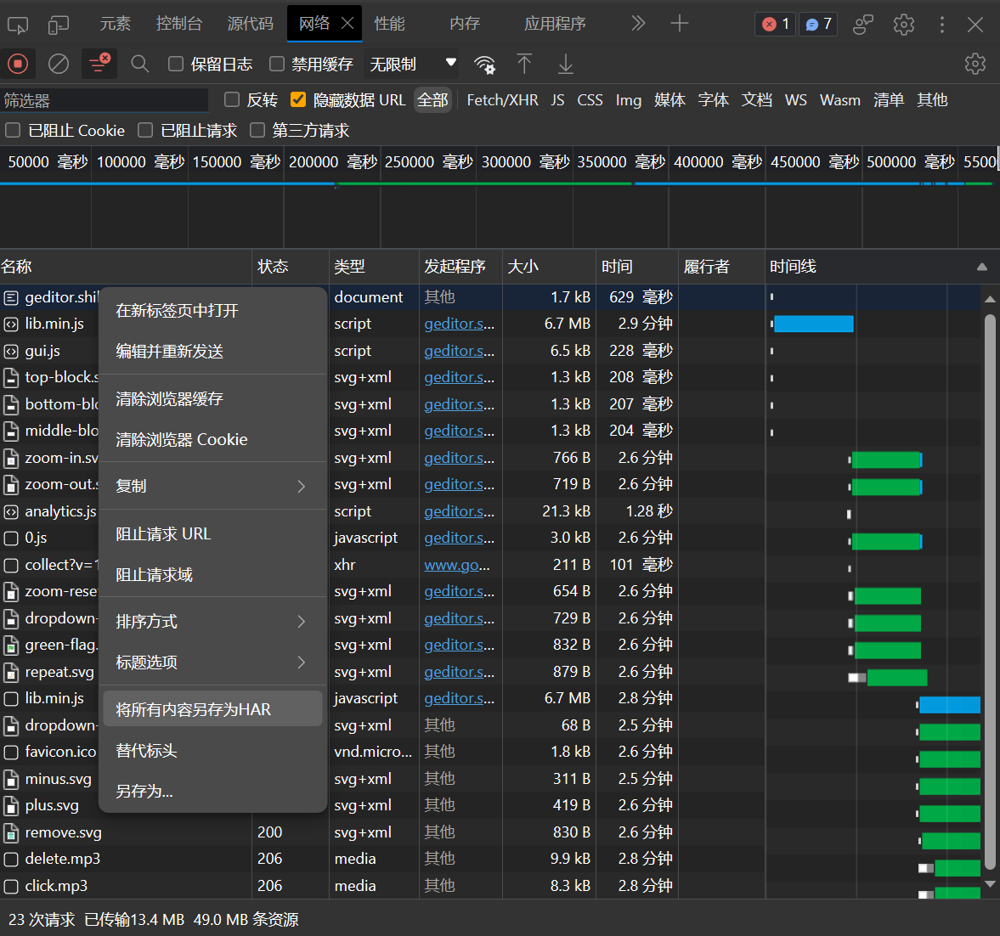
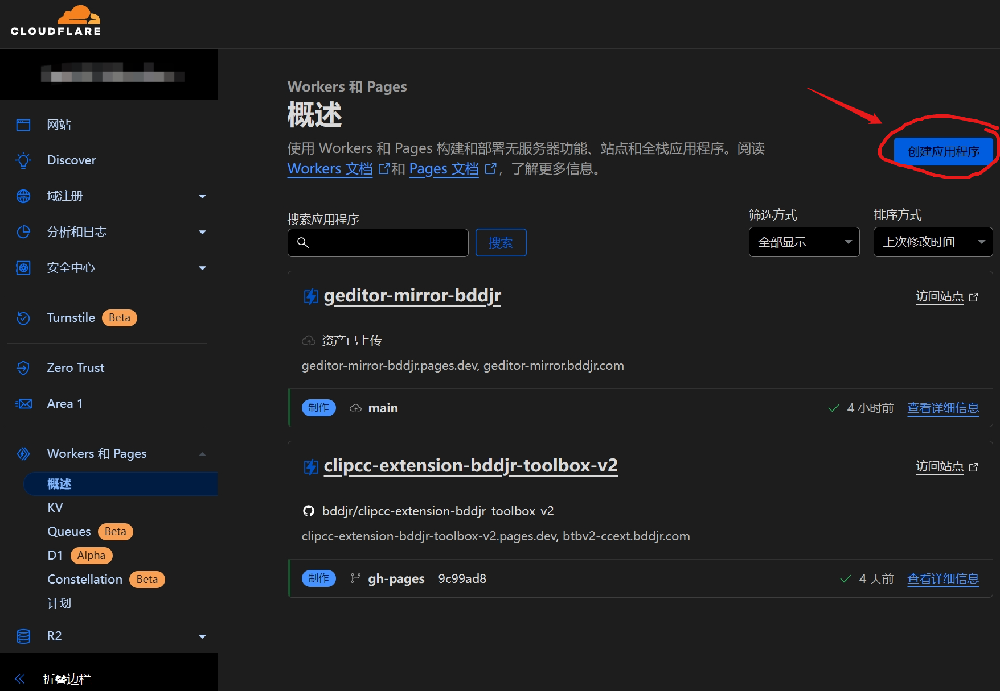
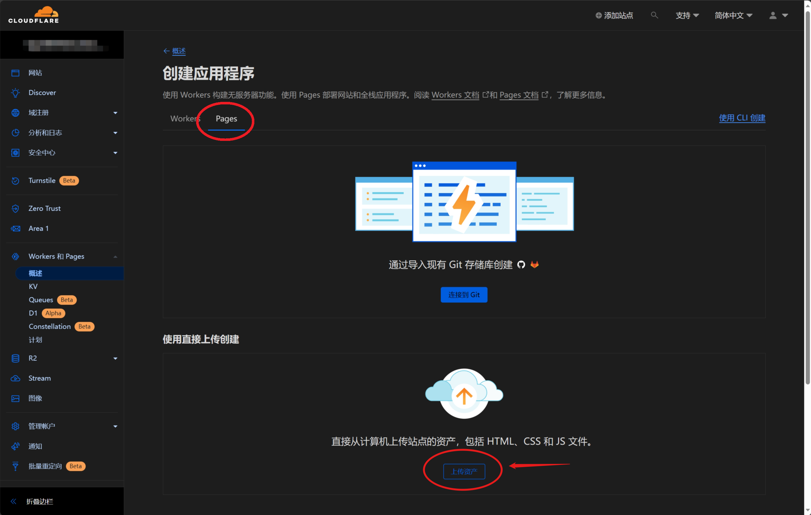

# geditor mirror tool

## 构建一个镜像站
1、  
F12打开开发者工具，查看“网络”这栏，勾选“隐藏数据URL”，然后访问网址  
https://geditor.shiki.online  
（请尽可能遍历该网站自带的资源）  

2、  
导出 geditor.shiki.online.har 文件到当前目录  
  

3、  
预先安装Nodejs，然后在当前目录运行命令
```
node har-to-files.js
```
会生成 ouput 文件夹，里面就是抓取的资源了。  

4、  
在Cloudflare创建应用程序  
  

5、  
在Cloudflare创建Pages  
  
